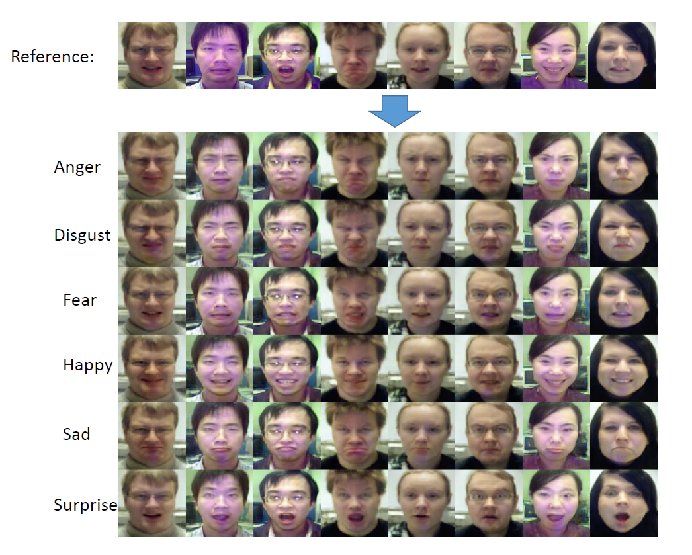

# ExprGAN
Implementation of the AAAI 2018 oral paper: "ExprGAN: Facial Expression Editing with Controllable Expression Intensity", https://arxiv.org/pdf/1709.03842.pdf

The proposed method in the paper can also generate the expressions with different intensities. 
However the different intesities are randomly generated by the random variable with the conditional GAN, in which the expression cannot be generated with a specific intensity. The expression with different intensities shown in the following figure in fact are collected mnanually among dozens images with different variations of the intensities.

# Train
1. Download OULU-CASIA dataset and put the images under data folder: http://www.cse.oulu.fi/CMV/Downloads/Oulu-CASIA. split/oulu_anno.pickle contains the split of training and testing images.
2. Download vgg-face.mat from matconvenet website and put it under joint-train/utils folder:  http://www.vlfeat.org/matconvnet/pretrained/ 
3. To overcome the limited training dataset, the training is consisted of three stages: 
  a) Go inot train-controller folder to first train the controller module, run_controller.sh;
  b) Go into join-train folder for the second and third stage training, run_oulu.sh.
  Plese see our paper for more training details.

A trained model can be downloaded here: https://drive.google.com/open?id=1bz45QSdS2911-8FDmngGIyd5K4gYimzg

# Test
1. Run joint-train/test_oulu.sh

